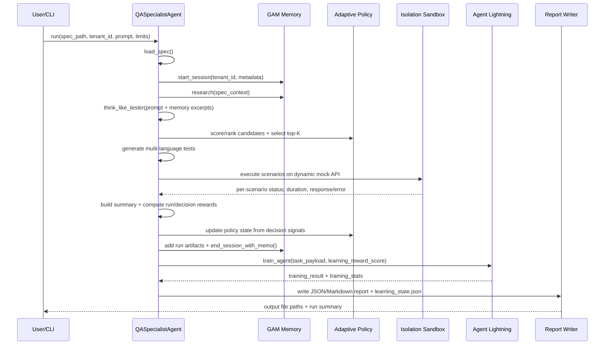

# QA Specialist Agent Architecture (SpecTestPilot + Agent Lightning + GAM)

## 1. Purpose
This document defines the production-ready architecture for a QA-specialist agent that:

1. Reads OpenAPI specs.
2. Generates human-like QA test scenarios.
3. Executes tests in isolated environments.
4. Produces structured reports.
5. Learns over time using Agent Lightning RL.
6. Retains contextual memory using GAM with tenant isolation.

## 2. Design Goals
1. Safety first: test execution must be isolated and deterministic by default.
2. Contract correctness: no invented endpoints, schema-valid outputs.
3. Explainability: every run must produce inspectable traces, memory artifacts, and reward breakdowns.
4. Learning loop: run outcomes must feed policy/value training.
5. Multi-tenant isolation: memory and retrieval must be scoped by tenant.

## 3. High-Level Architecture

```text
                     +--------------------------------------------+
                     |                Control Plane               |
                     |      CLI runner / scheduler / triggers     |
                     +---------------------+----------------------+
                                           |
                                           v
      +------------------------------------+------------------------------------+
      |                  Agent Runtime Plane (QASpecialistAgent)                |
      | parse spec -> GAM research -> scenario generation -> adaptive selection  |
      |        isolated execution -> summary -> report -> RL invocation          |
      +-------------------------+-----------------------------+------------------+
                                |                             |
                                |                             v
                                |        +--------------------+------------------+
                                |        |      Isolation Plane                   |
                                |        | DynamicMockServer + FastAPI TestClient |
                                |        +----------------------------------------+
                                |
                                v
      +-------------------------+------------------+        +--------------------+------------------+
      |      Memory Plane (GAM)                    |<------>| Learning Plane (Current Implementation) |
      | sessions / pages / memo / retrieval        |        | AgentLightningTrainer                     |
      +--------------------------------------------+        | + ObservabilityCollector                  |
                                                            | + CreditAssignmentModule                  |
                                                            | + LightningRLAlgorithm (replay buffer)   |
                                                            +--------------------+------------------+
                                                                                 |
                                                                                 v
                                                            +--------------------+------------------+
                                                            | Observability / Governance / Reporting |
                                                            | metrics, JSON+MD reports, learning log |
                                                            +----------------------------------------+
```

Official Agent Lightning target alignment:
`Algorithm <-> Runner <-> LightningStore`

## 4. Runtime Flow (Single Run)

```text
Input(spec, tenant, prompt)
  -> start GAM session
  -> GAM deep research (plan/search/integrate/reflect)
  -> scenario generation (human-style QA)
  -> runtime signal capture preparation (action/observation traces via learning plane)
  -> adaptive policy selection (contextual linear-UCB)
  -> multi-language test artifact generation
  -> isolated execution against dynamic mock API
  -> collect per-scenario results
  -> summarize pass/fail, latency, failures
  -> update adaptive policy state from rewards/penalties
  -> store transcript + artifacts + memo in GAM
  -> build RL task payload + reward
  -> Agent Lightning runner-equivalent processes traces and transitions
  -> Algorithm trains from replay/store-backed transitions
  -> receive RL training stats
  -> persist learning_state.json
  -> emit JSON + Markdown report
```

### 4.1 Runtime Sequence (Mermaid)



### 4.2 Step-by-Step Input/Output Contract

| Step | Component | Inputs | Processing | Outputs | Persisted State |
|---|---|---|---|---|---|
| 1 | Control Plane (CLI) | `spec_path`, `tenant_id`, `prompt`, `max_scenarios`, `pass_threshold`, `output_dir` | Initializes run configuration and paths | Agent instance with runtime config | None |
| 2 | Spec Loader | OpenAPI YAML/JSON file bytes | Parses + validates top-level object | Parsed `spec` dictionary | None |
| 3 | GAM Session Start | `tenant_id`, spec metadata | Opens tenant-scoped session and records init event | `session_id` | GAM session transcript pages |
| 4 | GAM Research | Spec title, auth type, endpoint metadata, tenant context | plan -> search -> integrate -> reflect | Research plan, reflection, memory excerpts | GAM research traces and pages |
| 5 | Scenario Generation | Parsed spec + effective prompt (user prompt + memory excerpts) | HumanTesterSimulator generates candidate scenarios | Candidate `TestScenario[]` | None |
| 6 | Adaptive Selection | Candidate scenarios, policy state (`A`, `b`, scenario stats), RL risk estimate | Scores candidates (expected reward + uncertainty + failure focus + novelty + diversity penalties) and selects top-K | Selected scenarios + selection trace | `learning_state.json` fields: `adaptive_policy`, `scenario_stats`, `selection_trace` |
| 7 | Test Artifact Generation | Selected scenarios + `base_url` | Generates Python/JS/Java/cURL tests | `generated_tests/*` files | Generated test artifacts in output directory |
| 8 | Isolation Execution | Selected scenarios + copied spec | Builds dynamic FastAPI mock server and executes each scenario via TestClient | Per-scenario results (`expected_status`, `actual_status`, `passed`, `duration`, `error`) | `openapi_under_test.yaml` copy + scenario execution results in report |
| 9 | Summary + Reward | Scenario results + endpoint count + thresholds | Computes pass-rate metrics, quality gate, run reward, decision rewards | Summary object + decision learning signals | Included in report (`learning.feedback`) |
| 10 | Learning State Update | Decision signals + previous weights/stats | Updates test-type weights, endpoint weights, scenario stats, policy posterior (`A`, `b`) | Updated learning snapshot | In-memory state ready for final persistence |
| 11 | GAM Memo Finalization | Summary, issues, decisions, artifacts | Adds execution artifacts to session and closes session with memo | Memo page + lossless page ids | GAM memo/lossless pages |
| 12 | Agent Lightning Training | `task_payload` (`pass_rate`, `failed_scenarios`, summary, `learning_reward_score`) | Collects traces, assigns credit, creates transitions, executes RL `train_step` and autosaves checkpoint | `training_result`, `training_stats` | RL model/replay persisted to checkpoint file + reported in JSON/MD |
| 13 | Report Persistence | Summary, learning, GAM, RL stats, generated file map | Writes JSON/MD reports and saves learning state file | `qa_execution_report.json`, `qa_execution_report.md`, `learning_state.json` | Report files + persisted learning state |

### 4.3 Learning Plane I/O (Focused)

1. Input to learning plane:
   - run-level quality signals (`pass_rate`, failed count, threshold)
   - decision-level signals (per scenario reward/penalty)
   - execution traces (action/observation)
2. Internal transformations:
   - credit assignment over traces
   - transition construction for replay
   - value update (`train_step`)
   - policy-state update for scenario selection (`A`, `b`, scenario stats)
3. Output from learning plane:
   - RL training stats (`buffer_size`, `training_steps`, loss)
   - updated adaptive selection behavior in next run
   - persisted `learning_state.json` (policy/state snapshot)

## 5. Component Responsibilities

### 5.1 Control Plane
Responsibilities:
1. Accept run requests and enforce tenant config.
2. Trigger pipeline execution.
3. Provide retry policy and scheduling.

Current implementation:
1. CLI entrypoint at `qa_specialist_runner.py`.
2. Core orchestration in `spec_test_pilot/qa_specialist_agent.py`.

### 5.2 Agent Runtime Plane
Responsibilities:
1. Parse and inspect OpenAPI.
2. Plan tests like QA engineers (happy path, auth, validation, boundary, error, security).
3. Generate executable assets.
4. Execute scenarios and aggregate outcomes.

Current implementation:
1. `QASpecialistAgent.run()` orchestrates end-to-end flow.
2. `HumanTesterSimulator` creates scenarios.
3. `MultiLanguageTestGenerator` writes Python/JS/Java/cURL artifacts.
4. Per-scenario execution records expected vs actual status and timing.

### 5.3 Isolation Plane
Responsibilities:
1. Never execute tests directly against shared host process state.
2. Use ephemeral API runtime per run.
3. Enforce deterministic baseline behavior.

Current implementation:
1. Dynamic FastAPI app created from spec (`agent_lightning_server.py`).
2. In-memory isolated execution via `fastapi.testclient.TestClient`.

Future hardening:
1. Add Docker/Firecracker mode for stronger filesystem/network isolation.
2. Add CPU/memory/time quotas per test batch.

### 5.4 Memory Plane (GAM)
Responsibilities:
1. Session lifecycle (`start_session`, `add_to_session`, `end_session_with_memo`).
2. Lossless storage of transcript/tool outputs/artifacts.
3. Retrieval with tenant isolation.
4. Deep-research loop: plan -> search -> integrate -> reflect.

Current implementation:
1. `PageStore`, `Memorizer`, `Researcher`, `GAMMemorySystem`.
2. Hybrid retrieval over BM25 + optional vector.
3. Retrieval tools in research path:
   - query retrieval
   - group/tag retrieval
   - page-id retrieval
4. Parallel retrieval execution and result merge.

### 5.5 Learning Plane (Agent Lightning)
Responsibilities:
1. Collect non-intrusive traces.
2. Assign credit over trajectories.
3. Convert traces into RL transitions.
4. Update value/policy models.

Official model from Microsoft docs/GitHub:
1. Core components are `Algorithm`, `Runner`, and `LightningStore`.
2. `LightningStore` is the source of truth for `Rollout`, `Attempt`, `Span`, `Resource`, and train tickets.
3. `Runner` bridges algorithm and store, drives execution lifecycle, and triggers training loops.
4. Runtime instrumentation writes spans/resources (for example via tracer context and OpenTelemetry span helpers).
5. Training is typically triggered via trainer/runner APIs (`fit(...)`, `run(...)`), with clear separation between runtime and trainer.

Current repo mapping:
1. `AgentLightningTrainer` in `spec_test_pilot/agent_lightning_v2.py` acts as trainer/runner coordinator.
2. `ObservabilityCollector` is used as an in-memory trace collector for action/observation spans.
3. `CreditAssignmentModule` performs trajectory credit assignment.
4. `LightningRLAlgorithm` holds replay buffer and runs `train_step`.
5. QA agent invokes RL each run (`train_agent`) and writes training stats to reports.
6. RL checkpoint save/load is implemented for replay + model/optimizer state, enabling learning continuity across process restarts when the same checkpoint path is used.
7. This is aligned conceptually with Agent Lightning disaggregation, but not yet a full adoption of the official `LightningStore` data model APIs.

### 5.6 Adaptive Selection Policy
Responsibilities:
1. Rank candidate scenarios using learned expected reward and uncertainty.
2. Balance exploitation (known weak areas) with exploration (uncertain areas).
3. Persist scenario-level learning signals across runs.
4. Expose explainable selection traces in reports.

Current implementation:
1. Contextual linear-UCB policy in `spec_test_pilot/adaptive_policy.py`.
2. Features include test type, method, endpoint shape, expected status, request-shape flags.
3. Selection score combines expected reward, exploration bonus, failure-focus bonus, RL risk, novelty bonus, and diversity penalty.
4. Policy state (`A`, `b`, scenario stats) persists in `learning_state.json`.

## 6. Data Contracts

### 6.1 Input Contract
```json
{
  "spec_path": "examples/banking_api.yaml",
  "tenant_id": "qa_team",
  "prompt": "Generate auth and validation QA cases",
  "max_scenarios": 50,
  "pass_threshold": 0.70
}
```

### 6.2 Scenario Execution Contract
Each scenario yields:
1. `name`, `test_type`, `method`.
2. `endpoint_template`, `endpoint_resolved`.
3. `expected_status`, `actual_status`.
4. `passed`, `duration_ms`, `error`, `response_excerpt`.

### 6.3 Report Contract
Report includes:
1. Metadata (spec, tenant, timestamps, isolation mode).
2. Summary (pass rate, quality gate, breakdowns, failures).
3. Generated test file paths.
4. Scenario results.
5. GAM details (session, memo page, research evidence).
6. Agent Lightning results (training result + training stats).

## 7. Learning Loop: How “Smarter” Emerges

### 7.1 Short-term Improvement (Memory)
1. Prior failures and conventions are retrieved from GAM.
2. Retrieved excerpts are injected into prompt context.
3. Next run scenario emphasis shifts based on memory.

### 7.2 Medium-term Improvement (RL)
1. Outcome summary becomes reward signal.
2. Sidecar traces become transitions.
3. Replay buffer grows during process lifetime.
4. Value loss trends indicate model fitting progress.
5. With checkpoint enabled, CLI restarts can resume replay buffer/model weights from checkpoint path.
6. Full official-store parity (Rollout/Attempt/Span/Resource persistence) is not yet implemented.

### 7.3 Policy-Controlled Learning (Implemented)
Current state:
1. Scenario selection is now driven by a contextual linear-UCB policy, not only static rules.
2. The policy uses learned expected reward, uncertainty (exploration), failure-focus bonus, and RL risk to rank candidates.
3. Per-scenario outcomes update persistent policy state (`A`, `b`, scenario stats) across runs.
4. Selection decisions are emitted into run reports for explainability.

## 8. Current State Assessment

### 8.1 What Is Working
1. End-to-end pipeline runs successfully.
2. Reports are generated (JSON + Markdown).
3. GAM sessions/memos/pages are created and searchable.
4. Agent Lightning training executes on each run and exposes training stats.
5. Adaptive policy learns from per-scenario reward/penalty and persists across runs.
6. Agent Lightning checkpoint save/load persists RL state across restarts.
7. Test suite passes.

### 8.2 Improvement Needed
1. Checkpoint lifecycle management (rotation, retention, corruption recovery).
2. Stronger reward shaping (coverage deltas, severity-weighted failures, flake penalty).
3. Real SUT mode in addition to mock mode.
4. Multi-step policy actions (workflow chains, retries, recovery scenarios) beyond one-pass ranking.
5. Trend analytics across runs (run-to-run quality regression detection).
6. Migrate learning data plane to official `LightningStore` entities and runner workflow.

## 9. Target Production Architecture (Recommended)

### Phase 1: Stable Baseline
1. Keep current flow.
2. Add persistent model/replay store.
3. Add run registry DB for report indexing.

### Phase 2: True Learning Control
1. Extend the policy gateway with multi-pass planning and adaptive retry generation.
2. Expand RL-to-policy linkage from ranking to action sequencing.
3. Add A/B policy rollout support.

### Phase 3: Enterprise Hardening
1. Containerized isolation for execution.
2. Strict per-tenant quotas and keys.
3. Full audit trail with artifact retention policy.
4. Quality gates integrated into CI.

## 10. Operational KPIs
1. Pass rate by endpoint category.
2. Coverage ratio by spec endpoints.
3. Defect detection density (unique failing patterns).
4. Mean test latency and timeout rate.
5. RL metrics: replay size, training steps, value loss trend.
6. GAM retrieval quality: hit rate of relevant pages.

## 11. Failure Modes and Controls
1. Spec parse failure
   - Control: fallback empty output + missing info contract.
2. Flaky execution
   - Control: deterministic mock mode baseline + re-run policy.
3. Memory contamination across tenants
   - Control: tenant_id scoped retrieval and storage checks.
4. RL drift
   - Control: checkpoint versioning + rollback.

## 12. Security and Tenant Isolation
1. Every run binds to `tenant_id`.
2. GAM retrieval honors tenant scope.
3. Artifacts are stored with source metadata and page references.
4. Sensitive data redaction should be added before long-term artifact retention.

## 13. File-to-Architecture Mapping
1. Orchestration: `spec_test_pilot/qa_specialist_agent.py`
2. CLI entrypoint: `qa_specialist_runner.py`
3. QA scenario design + codegen: `spec_test_pilot/multi_language_tester.py`
4. Isolated mock runtime: `agent_lightning_server.py`
5. Memory subsystem: `spec_test_pilot/memory/gam.py`
6. RL subsystem: `spec_test_pilot/agent_lightning_v2.py`
7. Adaptive policy subsystem: `spec_test_pilot/adaptive_policy.py`

## 14. Recommended Next Technical Changes
1. Add checkpoint lifecycle controls (rotation, retention, integrity checks, rollback policy).
2. Add `reward_service.py` with explainable reward components.
3. Add `run_registry` persistence (SQLite/Postgres).
4. Add policy-action API for multi-step planning (selection + retry + remediation).
5. Add dashboard-ready metrics export (Prometheus/OpenTelemetry).
6. Add an adapter layer that maps QA run events to official Agent Lightning store objects (`Rollout`, `Attempt`, `Span`, `Resource`) and uses official runner lifecycle.

## 15. Agent Lightning Reference Alignment
1. Microsoft project page: Agent Lightning is positioned as a framework to train arbitrary AI agents with reinforcement learning and near-zero code changes.
2. GitHub/docs define three primary runtime-training components: `Algorithm`, `Runner`, `LightningStore`.
3. GitHub/docs define store-native objects: `Rollout`, `Attempt`, `Span`, `Resource`.
4. Your architecture now reflects these terms explicitly and marks where current code is conceptual alignment vs full official API adoption.

## 16. Summary
The current architecture is a stronger v2: it executes the full QA workflow with isolation, memory, RL instrumentation, and an adaptive selection policy.

The highest-value next step is governance at scale: checkpoint lifecycle management, run registry, official store-model parity, and policy rollout controls.
