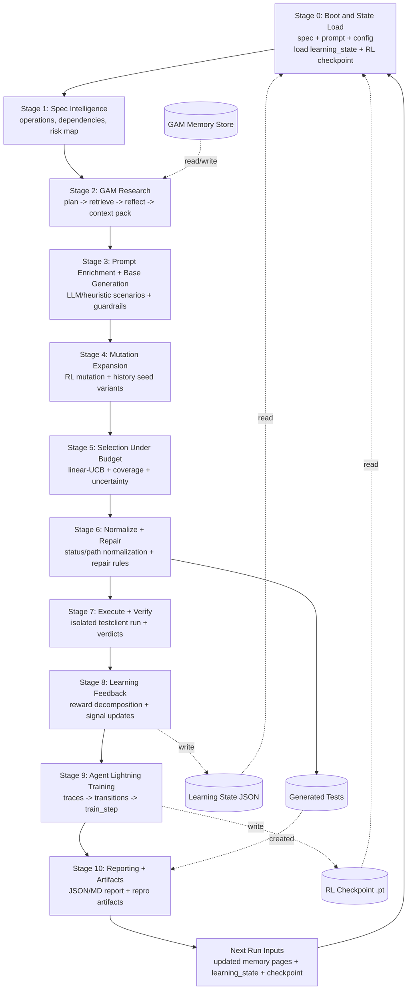
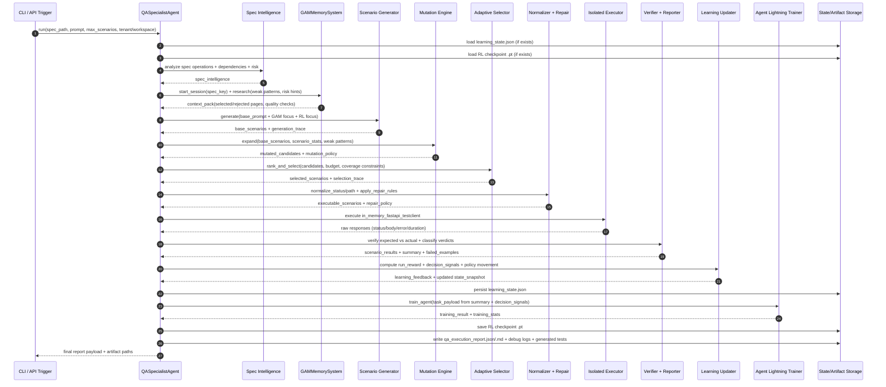
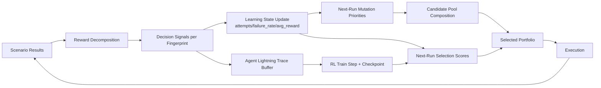

# SpecForge Architecture Flow (In Depth)

This document describes the full runtime flow of the QA testing agent, including GAM context retrieval, RL mutation/selection, execution, verification, learning, and reporting.

## 1. System Goal

Input:
1. OpenAPI spec
2. User base prompt
3. Runtime config (`tenant_id`, `workspace_id`, `max_scenarios`, pass threshold, isolation mode)

Output:
1. Executed scenario portfolio and pass/fail verdicts
2. Reproducible failure artifacts
3. Updated learning state (scenario stats, policy state)
4. Updated RL checkpoint (Agent Lightning)
5. Rich report JSON/Markdown for UI and diagnostics

## 2. Core Components

1. `QASpecialistAgent`
   - Orchestrator for the full pipeline.
2. `HumanTesterSimulator` / scenario generator
   - Produces base candidate scenarios from spec + effective prompt.
3. `GAMMemorySystem`
   - Retrieves and filters run-aware memory/context pack.
4. Adaptive selection policy (`contextual_linear_ucb`)
   - Ranks and selects scenarios under budget.
5. Mutation engine
   - Adds RL-guided variants and history-seeded candidates.
6. Isolated executor (`in_memory_fastapi_testclient`)
   - Runs scenarios against mock runtime.
7. Verifier + reporter
   - Produces summary metrics and failure examples.
8. Agent Lightning trainer
   - Trains on decision traces and updates checkpoint.

## 3. End-to-End Runtime Stages

## 3.1 Deep Flow Diagram (Stage Pipeline)

## 3.2 Deep Flow Diagram (Sequence + Data Contracts)

## 3.3 Decision and Feedback Loops (Why It Improves Over Runs)

## Stage 0: Boot and State Load

1. Load spec, prompt, tenant/workspace config.
2. Load learning state JSON (if present):
   - `scenario_stats`
   - test-type/endpoint weights
   - policy matrices/state
3. Load RL checkpoint `.pt` (if present):
   - replay buffer
   - value model
   - training step counters

## Stage 1: Spec Intelligence

1. Parse operations and auth expectations.
2. Build dependency graph (producer -> consumer operations).
3. Build workflow candidates (for sequence testing).
4. Estimate risk map per operation:
   - auth-required
   - write-operation
   - schema complexity
   - historical failure rate

Primary output:
1. `spec_intelligence` block in report.

## Stage 2: GAM Memory Research

1. Start GAM session for current spec scope (`spec_key`).
2. Build multi-query research plan from weak patterns and spec risks.
3. Retrieve memo pages and trusted fallback excerpts.
4. Run info-check reflection loop:
   - validate weak-pattern coverage
   - verify trend delta + next action presence
5. Build context pack:
   - selected pages
   - rejected pages and reasons
   - quality score and contract checks

Primary output:
1. `gam_context_pack`
2. Focus points for effective prompt enrichment.

## Stage 3: Effective Prompt + Base Scenario Generation

1. Start from user base prompt.
2. Enrich prompt with:
   - GAM trend/action focus points
   - RL weak-pattern priorities
3. Generate base scenarios (LLM primary or heuristic fallback).
4. Enforce guardrails:
   - happy-path operation coverage
   - workflow sequence probes
   - dedupe by scenario fingerprint

Primary output:
1. Base candidate pool (`llm_base` / `heuristic_base`).
2. `prompt_trace` and `scenario_generation_trace`.

## Stage 4: Mutation Expansion

1. Identify high-priority targets using:
   - failure rate
   - uncertainty
   - RL risk
   - operation-level failure context
2. Apply mutation strategies:
   - `missing_auth`, `invalid_auth`
   - `query_fuzz`
   - `missing_required_field`
   - learned schema-driven variants (for example numeric underflow)
3. Add history-seed scenarios from previous weak fingerprints.
4. Keep dedupe guarantees and mutation budget per target.

Primary output:
1. Candidate pool expansion (`rl_mutation`, `rl_history_seed`).
2. `mutation_policy` and mutation trace.

## Stage 5: Selection Under Budget

1. Score candidates with contextual linear-UCB:
   - expected reward
   - uncertainty / exploration bonus
   - failure-focus bonus
   - novelty bonus
   - diversity penalty
2. Enforce coverage constraints:
   - happy-path
   - core negative types
3. Select up to `max_scenarios` with strict cap checks.
4. Emit selection reasons and top decisions.

Primary output:
1. Final selected scenario portfolio.
2. `selection_policy`, `selection_decision_trace`, source breakdown.

## Stage 6: Pre-Execution Normalization + Repair

1. Normalize expected statuses for known ambiguous patterns.
2. Normalize path parameters for deterministic not-found validation.
3. Apply repair rules for repeated, deterministic mismatches.
4. Preserve scenario fingerprint lineage for learning consistency.

Primary output:
1. Executable scenario list with stable expectations.
2. `repair_policy` summary.

## Stage 7: Execute + Verify

1. Execute each selected scenario in isolated mock runtime.
2. Capture:
   - actual status
   - response excerpt
   - error/duration
3. Verify status against expected and documented responses.
4. Mark verdict as:
   - `pass`
   - `fail`
   - `suspect`
   - `blocked`

Primary output:
1. `scenario_results`
2. `summary` with pass rate, quality gate, and failed examples.

## Stage 8: Learning Feedback and Policy Update

1. Compute run reward decomposition:
   - pass-rate component
   - coverage component
   - decision quality component
   - novelty/redundancy terms
   - reproducibility and safety penalties
2. Emit per-scenario decision signals.
3. Update learning state:
   - fingerprint attempts/failure rates
   - average rewards
   - weak pattern deltas
4. Track policy movement:
   - retained/added/removed fingerprints
   - turnover and Jaccard similarity

Primary output:
1. `learning.feedback`
2. `state_snapshot`
3. `weak_pattern_deltas`

## Stage 9: Agent Lightning Training

1. Build task payload from run summary + decision signals.
2. Convert decisions into RL traces/transitions.
3. Train value/policy model (`gradient_steps`, `batch_size`, LR).
4. Save checkpoint and update training counters.

Primary output:
1. `agent_lightning.training_result`
2. `agent_lightning.training_stats`
3. checkpoint path + buffer/training-step increments.

## Stage 10: Report and Artifacts

Main artifacts:
1. `qa_execution_report.json`
2. `qa_execution_report.md`
3. `generated_tests/test_api.py` (or JS/Java/cURL based on script kind)
4. `llm_scenario_debug.jsonl`
5. Learning state JSON + RL checkpoint

Repro artifacts for failures include:
1. minimized request payload
2. response excerpt
3. cURL repro command

## 4. Data Lineage (What Feeds What)

1. `spec_intelligence` feeds GAM focus + mutation target risk.
2. GAM context pack feeds prompt enrichment.
3. Prompt enrichment feeds base scenario generation.
4. Base scenarios + learning state feed mutation and selection.
5. Selected scenarios feed execution + verification.
6. Execution results feed learning feedback and RL training.
7. RL/GAM outputs feed the next run via checkpoint + memory pages.

## 5. Why RL and GAM Both Matter

GAM solves context quality:
1. Retrieves relevant run-aware memory.
2. Filters low-signal/stable trends.
3. Injects actionable focus points into prompt.

RL solves adaptive decisioning:
1. Chooses which scenarios to spend budget on.
2. Decides where to mutate for high information value.
3. Learns from repeated runs and shifts scenario portfolio.

Together:
1. GAM improves what is generated.
2. RL improves what is selected and learned.

## 6. Current Failure Interpretation Pattern

When one security scenario consistently fails while most pass:
1. Pipeline health can still be good (`meets_quality_gate=true`).
2. Persistent fail usually indicates API behavior/spec-policy mismatch.
3. Repro artifacts should be used to decide:
   - fix API validation behavior
   - or adjust expected status policy for that mutation class

## 7. Operational Checks

For each run, verify:
1. `prompt_was_enriched_by_gam = true` when GAM is enabled.
2. `prompt_was_enriched_by_rl = true` when RL is enabled.
3. `selected` source breakdown includes RL-derived candidates over time.
4. `rl_training_result.status = trained` and checkpoint saved.
5. `weak_pattern_deltas` trends are not repeatedly regressing on same fingerprint.

## 8. Practical Flow Summary

1. Read spec -> infer risks/dependencies.
2. Retrieve high-signal memory (GAM).
3. Generate base tests with enriched prompt.
4. Expand candidates through targeted mutations.
5. Select best portfolio under strict cap.
6. Normalize/repair scenarios before execution.
7. Execute and verify; collect reproducible failures.
8. Compute rewards, update learning state.
9. Train Agent Lightning, save checkpoint.
10. Emit full report and carry learning forward.
