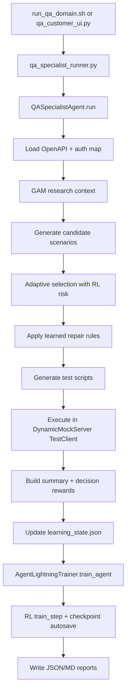

# QA Agent Glass-Box Deep Dive

This document explains the current QA agent as an inspectable system, not a black box.

It answers:

1. What each component does.
2. What data goes in and out at each step.
3. How learning is computed.
4. What is persisted across restarts.
5. Why RL may improve slowly or non-monotonically.

Scope: current runtime path used by `qa_specialist_runner.py` and `run_qa_domain.sh`.

## 1. Runtime Boundary

Primary execution path:

1. `qa_specialist_runner.py` -> `spec_test_pilot/qa_specialist_agent.py`
2. `spec_test_pilot/multi_language_tester.py`
3. `spec_test_pilot/adaptive_policy.py`
4. `agent_lightning_server.py`
5. `spec_test_pilot/agent_lightning_v2.py`
6. `spec_test_pilot/memory/gam.py`

Customer orchestration wrappers:

1. FastAPI backend: `qa_customer_ui.py`
2. Shell orchestrator: `run_qa_domain.sh`
3. Next.js customer UI: `customer-ui-next/`

## 2. Component Responsibilities

| Component | Main Role | Learns? | Persistence |
|---|---|---|---|
| `HumanTesterSimulator` | Generate scenario candidates from OpenAPI + prompt | No | None |
| `AdaptiveScenarioPolicy` | Contextual linear-UCB ranking and uncertainty scoring | Yes | Inside `learning_state.json` (`A`, `b`, `scenario_stats`) |
| `QASpecialistAgent` local weights | Per-test-type and per-endpoint weighting | Yes | `learning_state.json` |
| Repair policy in `QASpecialistAgent` | Auto-adjust repeated failing patterns | Yes | `learning_state.json` (`scenario_repair_rules`) |
| `AgentLightningTrainer` v2 | Build traces/transitions and train RL value model | Yes | RL checkpoint `.pt` |
| `DynamicMockServer` | Isolated in-memory API execution environment | No | None |
| `GAMMemorySystem` | Session memo + research context retrieval | No model training | In-memory pages during process (plus report references) |

Important: scenario generation is not RL-generated today. RL influences scenario ranking and risk prioritization after enough training maturity.

## 3. End-to-End Runtime Sequence



## 4. Step Contracts (Input -> Output -> Persistence)

## Step 0: Domain command construction

Code:

1. `run_qa_domain.sh`
2. `qa_customer_ui.py` (`_run_job`)

Input:

1. `domain`
2. `tenant_id`
3. `max_scenarios`
4. `pass_threshold`
5. `rl_checkpoint`
6. `verify_persistence`

Output:

1. Command line for `qa_specialist_runner.py`.

Persistence:

1. Optional customer workspace paths (`~/.spec_test_pilot/...`) in customer mode.

## Step 1: QA agent initialization

Code: `QASpecialistAgent.__init__`

Input:

1. `spec_path`
2. `tenant_id`
3. `output_dir`
4. `rl_checkpoint_path`
5. `learning_state_path`

Output:

1. `self.gam`
2. `self.rl_trainer` (checkpoint auto-load attempted)
3. `self.learning_state`
4. `self.adaptive_policy`

Persistence loaded:

1. RL checkpoint (`.pt`) if present.
2. Learning state JSON if present.

## Step 2: Spec + auth map

Code:

1. `_load_spec`
2. `_build_auth_requirement_map`

Input:

1. OpenAPI YAML/JSON file.

Output:

1. Parsed OpenAPI object.
2. Set of auth-required operation keys like `POST /orders`.

## Step 3: GAM research

Code:

1. `gam.start_session`
2. `gam.research`

Input context example:

```json
{
  "spec_title": "E-commerce API",
  "auth_type": "bearer",
  "endpoints": [{"method": "GET", "path": "/products"}],
  "tenant_id": "customer_default"
}
```

Output:

1. `research_result.plan`
2. `research_result.memory_excerpts`
3. `research_result.reflection`

## Step 4: Scenario generation

Code: `HumanTesterSimulator.think_like_tester`

Input:

1. Parsed OpenAPI model.
2. Effective prompt (`user prompt + GAM excerpt hints`).

Output:

1. `all_scenarios: List[TestScenario]`.

`TestScenario` fields used downstream:

1. `name`
2. `test_type`
3. `method`
4. `endpoint`
5. `headers`
6. `params`
7. `body`
8. `expected_status`

## Step 5: Learning-aware scenario selection

Code: `_select_scenarios_with_learning`

For each candidate, computed values include:

1. `type_weight` (from local state)
2. `endpoint_weight` (from local state)
3. `novelty_bonus` (new fingerprint)
4. `legacy_weight_bonus`
5. `rl_risk` (from RL value model, gated)
6. `score_parts` from `AdaptiveScenarioPolicy.score(...)`

Selection behavior:

1. Compute uncertainty threshold at quantile 0.75.
2. Force include uncertain scenarios first (`selection_reason=uncertainty_coverage`).
3. Fill remaining budget via score minus diversity penalties.
4. Persist decision trace.

Output:

1. `selected scenarios`.
2. `selection_trace`.
3. `selection_summary`.

Persistence:

1. `learning_state.selection_trace`
2. `learning_state.selection_summary`
3. Report `selection_policy.*`

## Step 6: Repair policy application

Code: `_apply_scenario_repairs`

Input:

1. Current selected scenarios.
2. `scenario_repair_rules` from prior runs.
3. Operation schema index from OpenAPI.

Possible actions:

1. `repair_request_body`: add missing required fields for write operations.
2. `override_expected_status`: rewrite expected status to observed dominant status.

Output:

1. Repaired scenarios.
2. Repair summary stats.

## Step 7: Script generation

Code: `_generate_test_files`

Output files:

1. `generated_tests/test_api.py`
2. `generated_tests/test_api.test.js`
3. `generated_tests/test_api.sh`
4. `generated_tests/APITests.java`

Also added to report under `generated_test_files`.

## Step 8: Isolated execution

Code:

1. `_execute_in_isolated_mock`
2. `DynamicMockServer`

Execution specifics:

1. Writes `openapi_under_test.yaml`.
2. Boots in-memory FastAPI mock server.
3. Executes each scenario with `fastapi.testclient.TestClient`.

Dynamic runtime checks in server:

1. Auth requirement checks.
2. Path/query parameter checks.
3. Request body required fields/type checks.
4. Special cases (`404` for `999`, etc.).

Output:

1. `scenario_results[]` (`ScenarioExecutionResult` list).

## Step 9: Summary + feedback

Code:

1. `_build_summary`
2. `_compute_learning_feedback`

Summary output:

1. totals/pass/fail/pass_rate
2. quality gate result
3. type breakdown
4. failed examples

Learning feedback output:

1. `run_reward`
2. `reward_breakdown`
3. `average_decision_reward`
4. `decision_signals[]`

Decision signal shape:

```json
{
  "name": "test_post__orders_no_auth",
  "test_type": "authentication",
  "method": "POST",
  "endpoint_template": "/orders",
  "endpoint_key": "POST /orders",
  "scenario_fingerprint": "POST|/orders|authentication|401|body=0|params=0",
  "has_body": false,
  "has_params": false,
  "reward": 1.1999,
  "passed": true,
  "expected_status": 401,
  "actual_status": 401
}
```

## Step 10: Local learning state update

Code: `_update_learning_state`

Updates:

1. Increment `run_count`.
2. Update `test_type_weights` and `endpoint_weights`.
3. Update scenario fingerprint stats (`attempts`, `passes`, `failures`, `avg_reward`, `failure_rate`, status histogram).
4. Update contextual bandit posterior via `AdaptiveScenarioPolicy.observe(...)`.
5. Refresh repair rules.

Then `_save_learning_state` writes JSON to disk.

## Step 11: RL training path

Code:

1. `_run_agent_lightning_training`
2. `AgentLightningTrainer.train_agent`
3. `_process_training_data`
4. `LightningRLAlgorithm.train_step`

RL task payload includes:

1. run summary
2. `learning_reward_score`
3. dense `decision_signals[]`

Trainer creates traces:

1. start action trace
2. one trace per decision signal (`type=scenario_decision`)
3. final observation trace

Then:

1. credit assignment
2. transition creation
3. replay buffer append
4. train step
5. checkpoint autosave

## Step 12: Report emission

Code: `_write_reports`

Writes:

1. `qa_execution_report.json`
2. `qa_execution_report.md`

Contains top-level sections:

1. `metadata`
2. `summary`
3. `learning`
4. `selection_policy`
5. `repair_policy`
6. `generated_test_files`
7. `scenario_results`
8. `gam`
9. `agent_lightning`
10. `paper_references`
11. `report_files`

## 5. Exact Learning Math

## 5.1 Scenario score (contextual bandit + extras)

In `AdaptiveScenarioPolicy.score`, final ranking value is:

`score = expected_reward + exploration_bonus + failure_focus_bonus + rl_risk + novelty_bonus + legacy_weight_bonus - diversity_penalty`

where:

1. `expected_reward = theta dot x`
2. `exploration_bonus = alpha * uncertainty`
3. `failure_focus_bonus = 0.40 * failure_rate`

## 5.2 Run reward

`run_reward = 0.55*pass_rate + 0.25*coverage_ratio + 0.20*(1-failure_ratio) - 0.15*latency_penalty`

clamped into `[0, 1]`.

## 5.3 Decision reward

Base:

1. `+1.0` if pass
2. `-1.0` if fail

Adjustments:

1. `+0.20` if passed negative-status validation case.
2. `-0.20` if failed expected-success case.
3. `-0.10` if failed negative-status case.
4. Latency penalty up to `0.20`.

Final clamped into `[-1.5, 1.5]`.

## 5.4 Local weight update

For each decision signal reward `r`:

`new_weight = clamp(old_weight + (-r * 0.20), 0.2, 5.0)`

Interpretation:

1. Negative reward increases focus weight for that type/endpoint.
2. Positive reward decreases repeated focus pressure.

## 5.5 Repair rule activation thresholds

A pattern enters repair-rule candidate set only if all are true:

1. `attempts >= 3`
2. `failure_rate >= 0.85`
3. dominant actual status ratio `>= 0.70`
4. dominant status is a valid HTTP code

## 6. RL Internals and Gating

## 6.1 RL influence gate for selection

In `_predict_rl_state_risk`, RL risk is ignored until:

1. `rl_training_steps >= 3`
2. `rl_buffer_size >= 32`

Before that, `rl_risk = 0`.

## 6.2 Train-step gate

In `LightningRLAlgorithm.train_step`:

1. Minimum replay samples required: `max(4, min(batch_size, 8))`.
2. If insufficient, training is skipped with reason.

## 6.3 Replay-driven gradient steps

Gradient updates per call:

1. 1 step normally
2. 2 steps if replay >= `2 * batch_size`
3. 4 steps if replay >= `4 * batch_size`

## 6.4 Model-ready flag

`get_training_stats` reports:

`rl_model_ready = (rl_training_steps >= 3 and rl_buffer_size >= 32)`

## 7. Persistence Map

| File | Purpose | Loaded At Start? |
|---|---|---|
| `<checkpoint>.pt` | RL model weights + optimizer + replay + metadata | Yes |
| `<checkpoint>_learning_state.json` (default) | Local QA learning state + adaptive policy + repair rules | Yes |
| `qa_execution_report.json` | Run output and diagnostics | No (read for UI) |
| `qa_execution_report.md` | Human-readable run report | No |
| `generated_tests/*` | Generated scripts | No |
| `openapi_under_test.yaml` | Copied runtime spec used in isolation | No |

## 8. Report Field to Producer Map

| Report Field | Produced By | Meaning |
|---|---|---|
| `summary.*` | `_build_summary` | Run-level QA metrics |
| `learning.feedback.*` | `_compute_learning_feedback` | Reward signals used by learning |
| `learning.state_snapshot.*` | `_learning_state_snapshot` | Compact view of learned state |
| `selection_policy.*` | `_select_scenarios_with_learning` | Why these scenarios were selected |
| `repair_policy.*` | `_apply_scenario_repairs` | Auto-repair action summary |
| `scenario_results[]` | `_execute_in_isolated_mock` | Actual per-scenario execution outcomes |
| `generated_test_files.*` | `_generate_test_files` | Paths to generated scripts |
| `gam.*` | GAM session/research calls | Memory/session context outputs |
| `agent_lightning.training_result` | `AgentLightningTrainer.train_agent` | RL execution/training result |
| `agent_lightning.training_stats` | `get_training_stats` | RL counters and readiness |

## 9. Why "One Case Keeps Failing" Can Persist

If one scenario fails across many runs, common reasons are:

1. The API behavior really disagrees with the expected status in generated scenario.
2. Repair rule thresholds are not reached yet (`attempts`, `failure_rate`, `dominant_ratio`).
3. Selection budget still spends scenarios on exploration, not only that failing case.
4. RL maturity gate not yet passed, so RL risk is not affecting selection.
5. Persistent mismatch is a spec/design issue, not a policy issue.

## 10. Practical Verification Commands

Run with persistence check:

```bash
./backend/run_qa_domain.sh --domain ecommerce --customer-mode --verify-persistence
```

Inspect RL counters:

```bash
jq '.agent_lightning.training_stats.rl_training_steps, .agent_lightning.training_stats.rl_buffer_size, .learning.agent_lightning_checkpoint' /tmp/<run_dir>/qa_execution_report.json
```

Inspect selected decision trace:

```bash
jq '.selection_policy.top_decisions[:10]' /tmp/<run_dir>/qa_execution_report.json
```

Inspect strongest failing fingerprints:

```bash
jq '.learning.state_snapshot.weakest_patterns' /tmp/<run_dir>/qa_execution_report.json
```

## 11. Official Agent Lightning vs Current QA Runtime

Current customer QA runtime uses:

1. `spec_test_pilot/agent_lightning_v2.py` (local implementation path)

Separate official package path exists in:

1. `spec_test_pilot/agent_lightning_official.py`
2. `official_agent_lightning_runner.py`

Both can coexist. They are different execution/training pipelines today.
