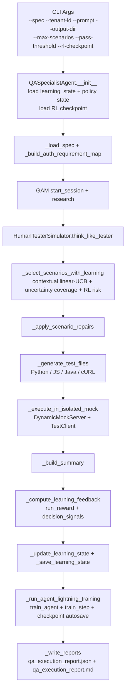
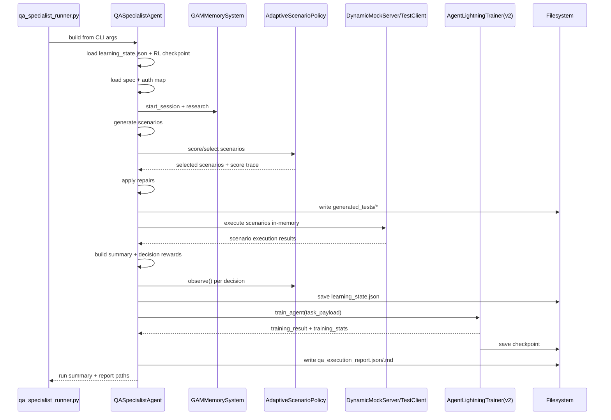

# QA Agent Runtime Step Map

This is a run-time map of the QA specialist pipeline, with each step showing:

1. exact code entrypoint
2. input payload for that step
3. output payload from that step
4. what gets persisted

Primary runtime path covered here:

1. `qa_specialist_runner.py`
2. `spec_test_pilot/qa_specialist_agent.py`
3. `spec_test_pilot/adaptive_policy.py`
4. `spec_test_pilot/agent_lightning_v2.py`

Customer-facing wrapper:

1. `run_qa_domain.sh --customer-mode --verify-persistence`
2. auto-manages persistent workspace/checkpoint and optional second-pass persistence validation

## 1. One-Page Flow Diagram



## 2. Runtime Sequence Diagram



## 3. Step-by-Step I/O Map

| Step | Code | Inputs | Outputs | Persisted |
|---|---|---|---|---|
| 0 | `build_arg_parser()/main()` | CLI args (`--spec`, `--prompt`, `--tenant-id`, `--base-url`, `--output-dir`, `--max-scenarios`, `--pass-threshold`, `--rl-checkpoint`) | configured `QASpecialistAgent` | none |
| 1 | `QASpecialistAgent.__init__` | parsed args | in-memory runtime state (`gam`, `rl_trainer`, `learning_state`, `adaptive_policy`) | output dir created; RL checkpoint loaded if exists |
| 2 | `_load_spec` | `spec_path` | parsed OpenAPI dict | none |
| 3 | `_build_auth_requirement_map` | OpenAPI dict | `self._auth_required_ops` set | none |
| 4 | `gam.start_session` + `gam.research` | tenant + spec metadata | research plan/reflection/excerpts | GAM session pages |
| 5 | `HumanTesterSimulator.think_like_tester` | spec + effective prompt | candidate `TestScenario[]` | none |
| 6 | `_select_scenarios_with_learning` | candidates + weights + policy state + RL risk | selected scenarios + `selection_trace` + `selection_summary` | stored later in `learning_state.json` + report |
| 7 | `_apply_scenario_repairs` | selected scenarios + schema + scenario stats | repaired scenarios + repair summary | repair rule state |
| 8 | `_generate_test_files` | repaired scenarios + base URL | file map for generated tests | `generated_tests/` files |
| 9 | `_execute_in_isolated_mock` | spec + repaired scenarios | `ScenarioExecutionResult[]` | `openapi_under_test.yaml` |
| 10 | `_build_summary` | execution results + spec | summary metrics (pass/fail/rate/gate) | in report |
| 11 | `_compute_learning_feedback` | scenarios + results + summary | `run_reward`, `decision_signals[]` | in report |
| 12 | `_update_learning_state` | decision signals | updated weights/stats/policy posterior | later saved in `learning_state.json` |
| 13 | `_save_learning_state` | current learning state | serialized learning snapshot | `learning_state.json` |
| 14 | `_run_agent_lightning_training` | `spec_title`, `summary`, `report_path`, `learning_feedback` | `training_result`, `training_stats` | RL checkpoint autosave |
| 15 | `_write_reports` | full report dict | JSON/MD report paths | `qa_execution_report.json`, `qa_execution_report.md` |

## 4. Detailed Step Contracts

## Step 0: CLI Input Contract

```json
{
  "spec": "/tmp/openapi_ecommerce.yaml",
  "prompt": "Generate comprehensive QA tests...",
  "tenant_id": "qa_demo",
  "base_url": "http://localhost:8000",
  "output_dir": "/tmp/qa_demo_run",
  "max_scenarios": 16,
  "pass_threshold": 0.7,
  "rl_checkpoint": "/tmp/agent_lightning_ecommerce.pt"
}
```

## Step 1: Runtime Initialization Contract

`QASpecialistAgent.__init__` creates and wires:

1. `self.gam = GAMMemorySystem(...)`
2. `self.rl_trainer = AgentLightningTrainer(...)`
3. `self.rl_trainer.register_agent("qa_specialist", self._qa_agent_feedback)`
4. `self.learning_state = _load_learning_state()`
5. `self.adaptive_policy = AdaptiveScenarioPolicy.from_state(...)`

Checkpoint behavior:

1. if checkpoint path exists, RL replay/model state is loaded
2. if missing, trainer starts clean

## Step 2: Spec Load Contract

Input:

1. file extension `.yaml/.yml` or JSON

Output:

1. top-level object (`dict`) required
2. throws if file missing or parse invalid

## Step 3: Auth Map Contract

Input:

1. global `security`
2. operation-level `security`

Output:

1. set of operation keys, e.g. `"POST /orders"`, requiring auth

Used later by `_normalize_auth_headers_for_execution`.

## Step 4: GAM Research Contract

Research context payload:

```json
{
  "spec_title": "E-commerce API",
  "auth_type": "bearer",
  "endpoints": [{"method":"GET","path":"/products"}],
  "tenant_id": "qa_demo"
}
```

Research output:

1. `plan`
2. `reflection`
3. `memory_excerpts[]`

These feed prompt composition.

## Step 5: Scenario Generation Contract

Input:

1. OpenAPI spec
2. effective prompt (`user prompt + memory excerpt hints`)

Output:

1. candidate `TestScenario[]`

Typical test types:

1. `authentication`
2. `input_validation`
3. `error_handling`
4. `boundary_testing`

## Step 6: Adaptive Selection Contract

Per candidate score components:

1. `expected_reward`
2. `uncertainty`
3. `exploration_bonus`
4. `failure_focus_bonus`
5. `rl_risk`
6. `novelty_bonus`
7. diversity penalties (endpoint/type repetition)

Selection policy behavior:

1. force uncertainty coverage set first
2. fill remaining budget by adjusted score rank
3. record top decision trace (name, score parts, reason)

Outputs persisted in report:

1. `selection_policy.top_decisions[]`
2. `selection_policy.uncertain_candidate_count`
3. `selection_policy.uncertain_selected_count`

## Step 7: Repair Rule Contract

Uses historical `scenario_stats` to create rule actions, e.g.:

1. `override_expected_status`
2. `repair_request_body`

Applied before execution and summarized as:

1. active rules
2. applied repairs
3. status overrides
4. request-body repairs

## Step 8: Generated Test Artifacts Contract

Outputs:

1. `generated_tests/test_api.py`
2. `generated_tests/test_api.test.js`
3. `generated_tests/test_api.sh`
4. `generated_tests/APITests.java`

## Step 9: Isolated Execution Contract

Execution runtime:

1. copy spec to `openapi_under_test.yaml`
2. start `DynamicMockServer` from copied spec
3. execute each scenario with in-memory `TestClient`

Per-scenario output:

```json
{
  "name": "test_post__orders_no_auth",
  "test_type": "authentication",
  "method": "POST",
  "endpoint_template": "/orders",
  "endpoint_resolved": "/orders",
  "expected_status": 401,
  "actual_status": 401,
  "passed": true,
  "duration_ms": 1.2,
  "error": "",
  "response_excerpt": "{...}"
}
```

## Step 10: Summary Contract

Summary object keys:

1. `total_scenarios`
2. `passed_scenarios`
3. `failed_scenarios`
4. `pass_rate`
5. `pass_threshold`
6. `meets_quality_gate`
7. `average_duration_ms`
8. `detected_endpoints`
9. `scenario_count_generated`
10. `test_type_breakdown`
11. `failed_examples`

## Step 11: Learning Feedback Contract

Run-level values:

1. `run_reward`
2. reward component breakdown

Decision-level values:

1. one `DecisionLearningSignal` per executed scenario
2. includes `scenario_fingerprint` and scalar `reward`

## Step 12/13: Learning State Update + Save

Updated structures:

1. `test_type_weights`
2. `endpoint_weights`
3. `scenario_stats` (attempts/failure_rate/avg_reward/status counts)
4. `decision_history`
5. `adaptive_policy` state (`A`, `b`, config)
6. `selection_trace`, `selection_summary`
7. `scenario_repair_rules`

Persisted at:

1. `<output_dir>/learning_state.json`

## Step 14: RL Training Contract

Task payload to RL:

```json
{
  "spec_title": "E-commerce API",
  "tenant_id": "qa_demo",
  "pass_rate": 0.875,
  "pass_threshold": 0.7,
  "total_scenarios": 16,
  "failed_scenarios": 2,
  "report_path": "/tmp/.../qa_execution_report.json",
  "summary": {"...": "..."},
  "learning_reward_score": 0.93,
  "decision_signals": [{"...": "..."}]
}
```

Inside `AgentLightningTrainer.train_agent(...)`:

1. start observability session
2. collect initial `action` trace
3. collect per-scenario `scenario_decision` traces from `decision_signals`
4. collect final `observation` trace
5. credit assignment
6. transition creation into replay buffer
7. RL `train_step`
8. checkpoint autosave

Reported back to QA report:

1. `agent_lightning.training_result`
2. `agent_lightning.training_stats`

## Step 15: Final Report Contract

`qa_execution_report.json` top-level keys:

1. `metadata`
2. `summary`
3. `learning`
4. `selection_policy`
5. `repair_policy`
6. `generated_test_files`
7. `scenario_results`
8. `gam`
9. `agent_lightning`
10. `paper_references`
11. `report_files`

## 5. Runtime Log Markers -> Step Mapping

| Log Marker | Mapped Step |
|---|---|
| `[OK] OpenAPI spec written` | pre-step 0 (domain wrapper script) |
| `[RUN] QA specialist agent` | step 0 |
| `Started observability session ...` | step 14 start |
| `RL training executed: Loss=...` | step 14 train step |
| `RL TRAINING ACTIVE: Step N ...` | step 14 train result |
| `QA specialist run complete` | step 15 done |
| `JSON report: ...` | step 15 output |

## 6. How to Inspect Each Step While Running

1. Run a domain:
```bash
./backend/run_qa_domain.sh --domain ecommerce --action both --output-dir /tmp/qa_map_demo --rl-checkpoint /tmp/qa_map_demo.pt
```

2. Inspect final report keys:
```bash
jq 'keys' /tmp/qa_map_demo/qa_execution_report.json
```

3. Inspect selection policy details:
```bash
jq '.selection_policy' /tmp/qa_map_demo/qa_execution_report.json
```

4. Inspect learning feedback + decision signals:
```bash
jq '.learning.feedback' /tmp/qa_map_demo/qa_execution_report.json
```

5. Inspect RL stats/checkpoint:
```bash
jq '.agent_lightning.training_stats, .learning.agent_lightning_checkpoint' /tmp/qa_map_demo/qa_execution_report.json
```

6. Inspect persisted policy/memory state:
```bash
jq '.run_count, .adaptive_policy.feature_dim, (.scenario_stats | length), (.scenario_repair_rules | length)' /tmp/qa_map_demo/learning_state.json
```

## 7. Known Separation: Current vs Official Path

1. `qa_specialist_runner.py` uses `agent_lightning_v2.py` runtime.
2. `official_agent_lightning_runner.py` uses `spec_test_pilot/agent_lightning_official.py` (official package adapter).
3. They are separate execution paths; this document maps the QA production path.
